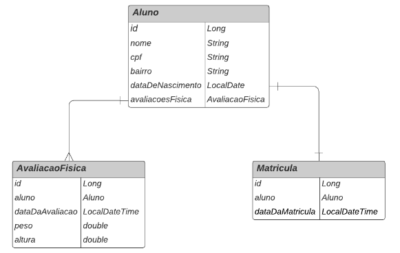
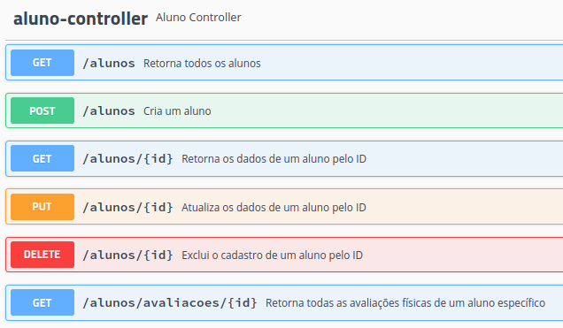
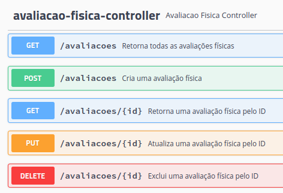
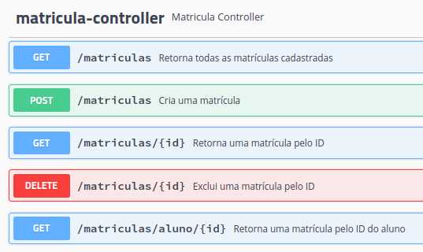

<h1>Academia Digital</h1>

API RESTful desenvolvida para o gerenciamento de uma academia, realizando mapeamento objeto relacional (ORM) usando o <strong>Spring Data JPA</strong> e <strong>PostgreSQL</strong>.

## 🛠 Tecnologias Utilizadas

<ul>
    <li>IDE IntelliJ</li>
    <li>Java 11</li>
    <li>Maven</li>
    <li><strong>Spring Web</strong></li>
    <li><strong>Spring Data JPA</strong></li>
    <li><strong>PostgreSQL Driver</strong></li>
    <li><strong>Hibernate Validator</strong></li>
    <li>Lombok</li>
    <li>Swagger</li>
</ul>

## ⚙️ Como rodar 
Após clonar o projeto em sua máquina, digite o comando:

```bash
mvn spring-boot:run 
```

O projeto estará rodando no endereço: <a href="http://localhost:8080">http://localhost:8080</a>.

## Diagrama Entidade-Relacionamento
A API criada foi baseada na seguinte modelagem de dados:




## 🟢 Swagger UI
A ferramenta <strong>Swagger UI</strong> foi utilizada para documentar e testar os endpoints da API. Após rodar o projeto, a documentação estará disponível no endereço <a href="http://localhost:8080/swagger-ui.html">http://localhost:8080/swagger-ui.html</a>, onde estarão os detalhes sobre cada endpoint da API, além de ter a funcionalidade de testá-los na própria plataforma.





